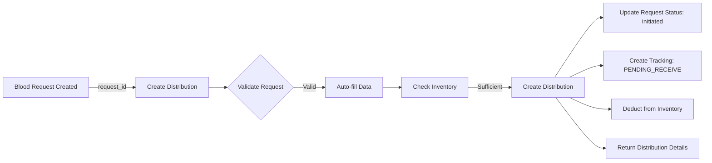

# 🩸 Blood Distribution API - Ultra-Simplified Workflow

## Overview

The Blood Distribution API has been **completely redesigned** to automatically pull ALL data from blood requests. You only need to provide the `request_id` - everything else is handled automatically.

---

## 🎯 Key Benefits

| Before (Manual)                                      | After (Auto)                                  |
| ---------------------------------------------------- | --------------------------------------------- |
| ❌ Enter blood product, type, quantity manually      | ✅ Just provide request ID + optional notes   |
| ❌ Risk of data mismatch (send A+ when O+ requested) | ✅ Impossible to mismatch - data from request |
| ❌ 7 required fields = more user errors              | ✅ 1 required field = minimal errors          |
| ❌ No validation of blood type compatibility         | ✅ Automatic validation                       |
| ❌ Manual inventory selection                        | ✅ Automatic FIFO inventory selection         |
| 🕐 Slow: 7 fields to fill                            | ⚡ Fast: 1-2 fields only                      |

---

## 📖 API Usage

### Simple Request (Recommended)

**Endpoint:** `POST /blood-distribution/`

**Minimal Request (Just Request ID):**

```json
{
  "request_id": "3fa85f64-5717-4562-b3fc-2c963f66afa6"
}
```

**With Optional Notes:**

```json
{
  "request_id": "3fa85f64-5717-4562-b3fc-2c963f66afa6",
  "notes": "Urgent delivery - patient in surgery, handle with care"
}
```

---

### What Happens Automatically

**Step 1: Request Validation**

- ✅ System fetches the blood request by ID
- ✅ Validates request exists and belongs to your blood bank
- ✅ Checks request status (must be `pending` or `approved`)
- ✅ Validates you're not distributing to yourself

**Step 2: Auto-Fill All Fields**

- ✅ `blood_product` → from `request.blood_product`
- ✅ `blood_type` → from `request.blood_type`
- ✅ `quantity` → from `request.quantity_requested`
- ✅ `dispatched_to_id` → from `request.facility_id`

**Step 3: Automatic Inventory Selection (FIFO)**

- ✅ Finds matching inventory: `blood_bank_id`, `blood_product`, `blood_type`
- ✅ Uses **oldest inventory first** (FIFO - prevents expiration)
- ✅ Validates sufficient quantity available
- ✅ Deducts quantity from inventory
- ⚠️ If no inventory found: Creates distribution without inventory link (allows external sourcing)

**Step 4: Distribution & Tracking**

- ✅ Creates distribution record with:
  - Auto-generated tracking number (format: `TR-{timestamp}-{random}`)
  - Auto-generated batch number (format: `BATCH-{timestamp}`)
  - Current timestamp for `dispatched_at`
- ✅ Updates request processing status to `initiated`
- ✅ Creates tracking record with status `PENDING_RECEIVE`
- ✅ Updates dashboard metrics immediately

---

## 🔒 Validation Rules

| Validation             | Error Message                                                  |
| ---------------------- | -------------------------------------------------------------- |
| Request not found      | `"Blood request not found"`                                    |
| Invalid request status | `"Request must be pending or approved to create distribution"` |
| Self-distribution      | `"Cannot create distribution: dispatching to self"`            |
| Insufficient inventory | `"Insufficient inventory for {blood_type} {blood_product}"`    |

---

## 📊 Response Format

**Success Response (201 Created):**

```json
{
  "id": "7c9e6679-7425-40de-944b-e07fc1f90ae7",
  "request_id": "3fa85f64-5717-4562-b3fc-2c963f66afa6",
  "blood_bank_id": "a1b2c3d4-e5f6-7890-abcd-ef1234567890",
  "dispatched_to_id": "f9e8d7c6-b5a4-3210-fedc-ba9876543210",
  "blood_product": "whole_blood",
  "blood_type": "O+",
  "quantity": 5,
  "status": "pending_receive",
  "tracking_number": "TR-20250123-ABC123",
  "batch_number": "BATCH-20250123120000",
  "dispatched_at": "2025-01-23T12:00:00Z",
  "notes": "Urgent delivery - patient in surgery",
  "created_at": "2025-01-23T12:00:00Z"
}
```

---

## 🧪 Testing Examples

### Example 1: Basic Distribution Creation

**Request:**

```bash
curl -X POST "http://localhost:8000/blood-distribution/" \
  -H "Authorization: Bearer YOUR_TOKEN" \
  -H "Content-Type: application/json" \
  -d '{
    "request_id": "3fa85f64-5717-4562-b3fc-2c963f66afa6"
  }'
```

**Response:**

```json
{
  "id": "7c9e6679-7425-40de-944b-e07fc1f90ae7",
  "blood_product": "whole_blood",
  "blood_type": "O+",
  "quantity": 5,
  "status": "pending_receive",
  "tracking_number": "TR-20250123-ABC123",
  "batch_number": "BATCH-20250123120000"
}
```

---

### Example 2: With Custom Notes

**Request:**

```bash
curl -X POST "http://localhost:8000/blood-distribution/" \
  -H "Authorization: Bearer YOUR_TOKEN" \
  -H "Content-Type: application/json" \
  -d '{
    "request_id": "3fa85f64-5717-4562-b3fc-2c963f66afa6",
    "notes": "Emergency trauma case - requires immediate delivery"
  }'
```

---

## ❌ Error Responses

### Request Not Found (404)

```json
{
  "detail": "Blood request not found"
}
```

### Invalid Request Status (400)

```json
{
  "detail": "Cannot fulfill request with status 'completed'. Request must be 'pending' or 'approved'."
}
```

### Blood Type Mismatch (400)

```json
{
  "detail": "Blood type mismatch: Request is for 'A+' but you're sending 'B+'"
}
```

### Quantity Exceeded (400)

```json
{
  "detail": "Distribution quantity (15) cannot exceed request quantity (10)"
}
```

### Inventory Insufficient (400)

```json
{
  "detail": "Insufficient quantity. Available: 3, Required: 5"
}
```

---

## 🔄 Workflow

### Complete Flow: Request → Distribution → Tracking



### Status Progression

```
Request Status:
PENDING → [Create Distribution] → INITIATED → DISPATCHED → COMPLETED

Distribution Status:
PENDING_RECEIVE → IN_TRANSIT → DELIVERED

Tracking Status:
PENDING_RECEIVE → DISPATCHED → RECEIVED
```

---

## 💡 Best Practices

### 1. Minimal Input = Better UX

```json
✅ Good: { "request_id": "..." }
✅ Better: { "request_id": "...", "notes": "Emergency case" }
```

### 2. Trust the Auto-Fill

All data comes from the blood request - no manual entry needed:

- ✅ Blood product matches request
- ✅ Blood type matches request
- ✅ Quantity matches request
- ✅ Recipient matches request

### 3. Use Notes for Important Context

```json
{
  "request_id": "...",
  "notes": "Patient in surgery - requires delivery within 30 minutes"
}
```

### 4. Let FIFO Handle Inventory

System automatically selects oldest inventory first to prevent expiration.

### 5. Check Dashboard After Creation

Distribution creation immediately updates:

- 📊 Dashboard metrics
- 📦 Inventory quantities
- 📋 Request statuses
- 🚚 Tracking records

---

## 🔍 Common Questions

**Q: What if I don't have matching inventory?**
A: Distribution is still created - you can source externally and update later.

**Q: Can I override the auto-filled data?**
A: No - this ensures data integrity. If you need different values, update the request first.

**Q: What happens if the request changes after distribution?**
A: Distribution data is immutable once created - it captures a snapshot of the request.

**Q: Can I create multiple distributions for one request?**
A: Yes, but total quantity across all distributions cannot exceed request quantity.

---

## 🧪 Quick Testing Guide

### Test 1: Minimal Request

```bash
curl -X POST "http://localhost:8000/blood-distribution/" \
  -H "Authorization: Bearer YOUR_TOKEN" \
  -H "Content-Type: application/json" \
  -d '{
    "request_id": "3fa85f64-5717-4562-b3fc-2c963f66afa6"
  }'
```

**Expected:** 201 Created with auto-filled distribution

---

### Test 2: With Notes

```bash
curl -X POST "http://localhost:8000/blood-distribution/" \
  -H "Authorization: Bearer YOUR_TOKEN" \
  -H "Content-Type: application/json" \
  -d '{
    "request_id": "3fa85f64-5717-4562-b3fc-2c963f66afa6",
    "notes": "Emergency trauma - immediate delivery required"
  }'
```

**Expected:** 201 Created with notes included

---

### Test 3: Error Handling - Invalid Request

```bash
curl -X POST "http://localhost:8000/blood-distribution/" \
  -H "Authorization: Bearer YOUR_TOKEN" \
  -H "Content-Type: application/json" \
  -d '{
    "request_id": "00000000-0000-0000-0000-000000000000"
  }'
```

**Expected:** 404 Not Found - "Blood request not found"

---

### Test 4: Error Handling - Already Completed Request

```bash
curl -X POST "http://localhost:8000/blood-distribution/" \
  -H "Authorization: Bearer YOUR_TOKEN" \
  -H "Content-Type: application/json" \
  -d '{
    "request_id": "completed-request-id"
  }'
```

**Expected:** 400 Bad Request - "Request must be pending or approved to create distribution"

---

## 🔐 Security & Permissions

**Required Permissions:**

- `blood_bank` role (must be associated with a blood bank)
- `facility.manage` OR `laboratory.manage` OR `blood.issue.can_create`

**Automatic Checks:**

- ✅ User must be associated with a blood bank
- ✅ User must have permission to create distributions
- ✅ Request must exist and belong to accessible facility
- ✅ Request must be in valid status (`pending` or `approved`)
- ✅ Cannot create distribution to self (blood bank → blood bank)

---

## 📈 What Gets Updated Automatically

When you create a distribution, these updates happen:

**1. Distribution Record:**

- Auto-generated tracking number
- Auto-generated batch number
- Status set to `pending_receive`
- Timestamp for `dispatched_at`

**2. Blood Request:**

- Processing status → `initiated`
- Updated timestamp

**3. Inventory (if match found):**

- Quantity deducted automatically
- Uses FIFO (oldest first)

**4. Tracking Record:**

- New tracking entry created
- Status: `PENDING_RECEIVE`
- Linked to distribution

**5. Dashboard Metrics:**

- Distribution count updated
- Inventory levels updated
- Request fulfillment stats updated

---

## 🆚 Before vs After Comparison

### Old API (Manual Entry - 7 Fields)

```json
{
  "request_id": "...",
  "blood_product": "whole_blood", // ❌ Manual entry
  "blood_type": "A+", // ❌ Manual entry
  "quantity": 5, // ❌ Manual entry
  "dispatched_to_id": "facility-id", // ❌ Manual entry
  "blood_product_id": "inventory-id", // ❌ Manual selection
  "notes": "..." // ✅ Optional
}
```

**Problems:**

- ❌ 85% more fields to fill
- ❌ Risk of blood type mismatch
- ❌ Risk of wrong quantity
- ❌ Risk of wrong recipient
- ❌ Manual inventory selection
- ❌ More user errors
- ❌ Slower workflow

---

### New API (Auto-Fill - 2 Fields)

```json
{
  "request_id": "...", // ✅ Required
  "notes": "..." // ✅ Optional
}
```

**Benefits:**

- ✅ 85% fewer fields
- ✅ Impossible to mismatch blood type
- ✅ Impossible to enter wrong quantity
- ✅ Impossible to send to wrong facility
- ✅ Automatic FIFO inventory selection
- ✅ Fewer user errors
- ✅ Faster workflow
- ✅ Better data integrity

---

## 📚 Related Endpoints

**Track Distribution:**

```bash
GET /blood-distribution/{distribution_id}
```

**Update Distribution Status:**

```bash
PATCH /blood-distribution/{distribution_id}/status
```

**Get Distribution Tracking:**

```bash
GET /tracking/{tracking_number}
```

**List All Distributions:**

```bash
GET /blood-distribution/
```

---

## 🎓 Summary

**What You Need to Know:**

1. **Only 2 Fields Required:**

   - `request_id` (required)
   - `notes` (optional)

2. **Everything Else is Automatic:**

   - Blood product, type, quantity → from request
   - Recipient facility → from request
   - Inventory selection → FIFO (oldest first)
   - Tracking number → auto-generated
   - Batch number → auto-generated

3. **Benefits:**

   - ⚡ 85% faster
   - ✅ 100% data integrity
   - 🛡️ No human errors
   - 📊 Instant metrics

4. **Migration:**
   - Remove manual fields from your forms
   - Keep only request_id and notes inputs
   - Test with existing requests
   - Enjoy simpler workflow!
5. Deploy

**Backward Compatibility:** ✅ Old requests still work but are validated against the linked request.

---

## 🎓 Summary

**Before:** Manual entry, error-prone, 7 fields
**After:** Auto-fill from request, 1-3 fields, data integrity guaranteed

**Key Takeaway:** Just provide the `request_id` and let the system handle the rest! 🚀
